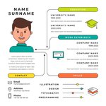

# My CV Responsive WebSite May 2020

## Table of contents
* [General info](#general-info)
* [Demo](#demo)
* [Technologies](#technologies)
* [Sources](#sources)

## General info
This site is build to present my short resume
## Demo 
Check demo here: [Demo](https://grafitosleg.github.io/MyCV_RWD/)
## Technologies
Project is created with:
* Html 5
* CSS 3 using flexbox

## Sources
This task is inspired by flynerd.pl
* Thanks to :
Freepik - title icon and background header made by [Freepik](https://freepik.com), licensed: CC 3.0
